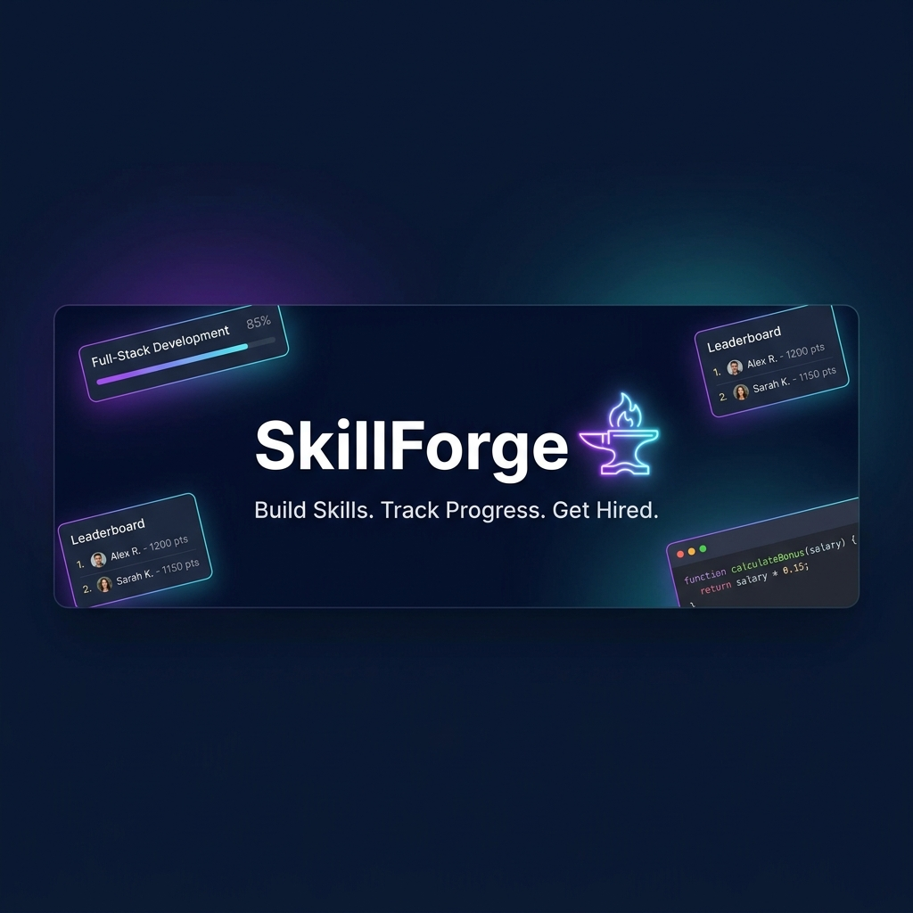
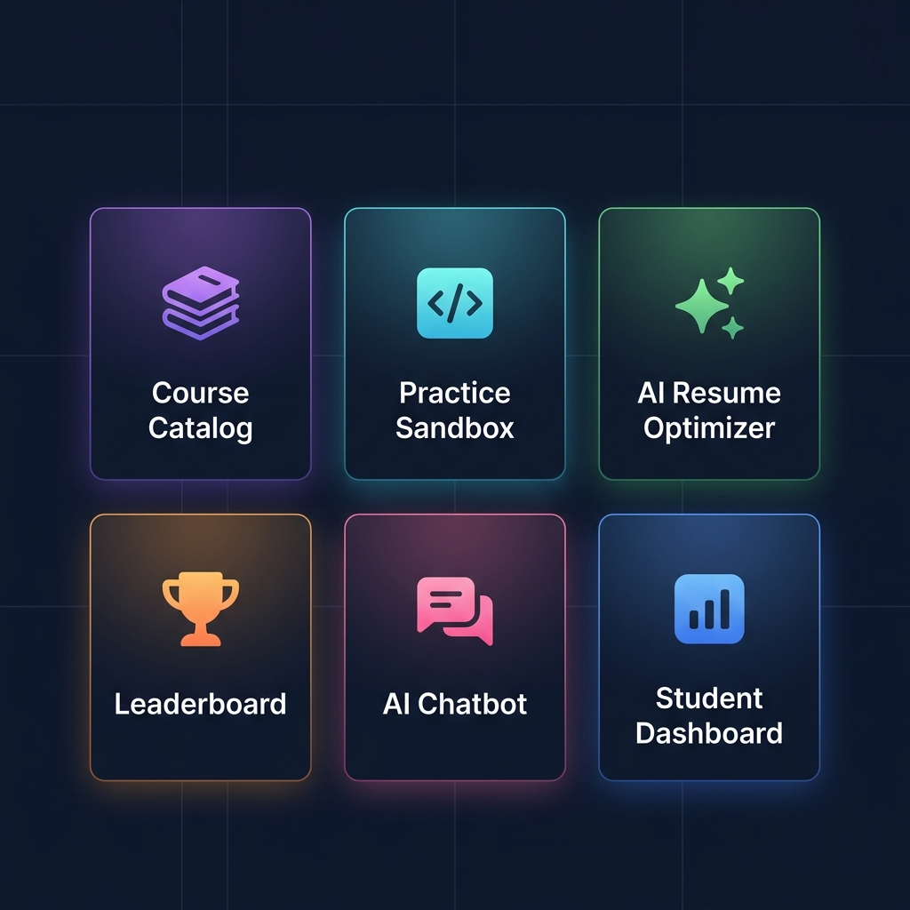
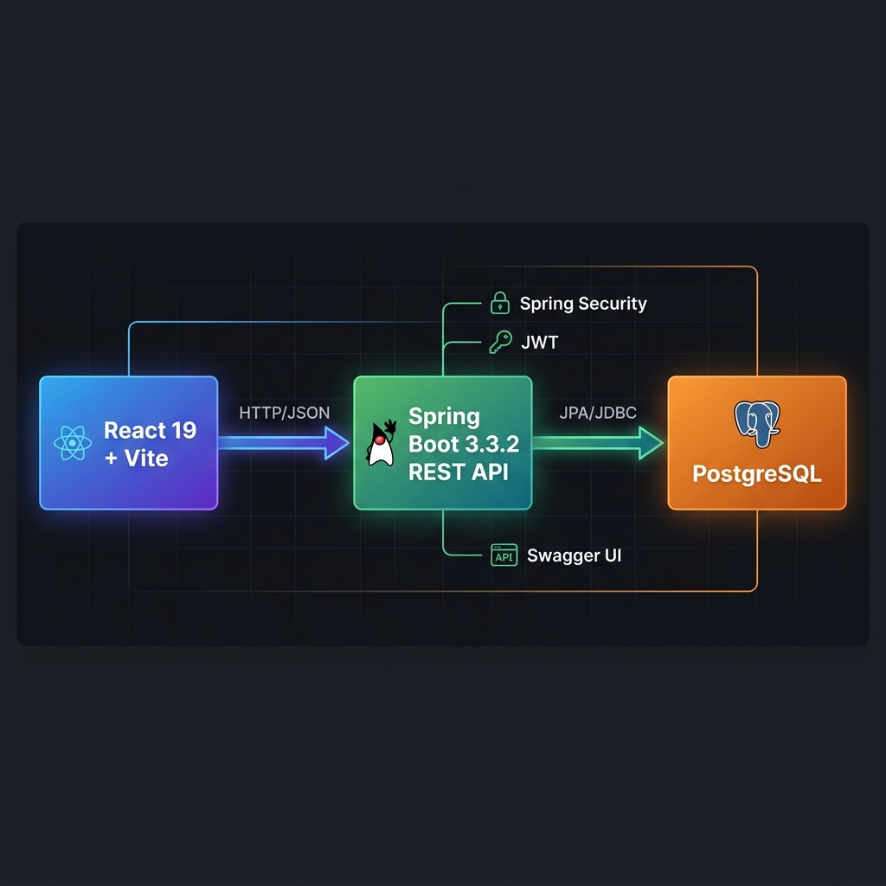
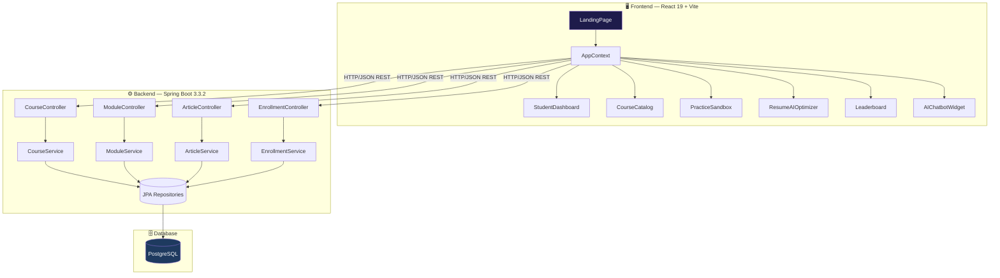
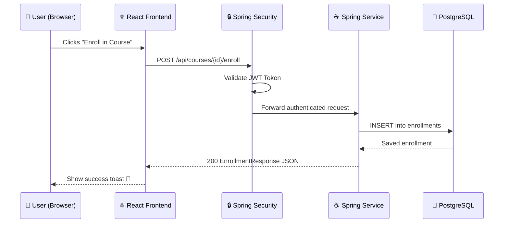
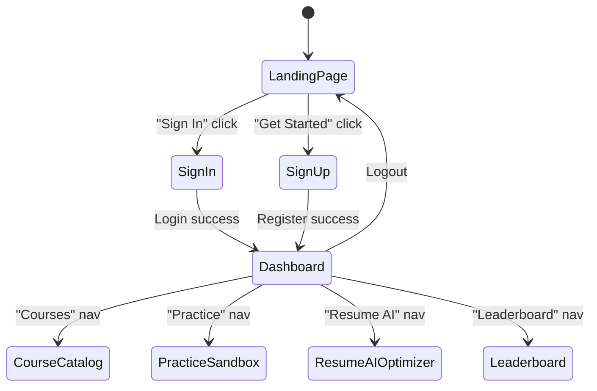
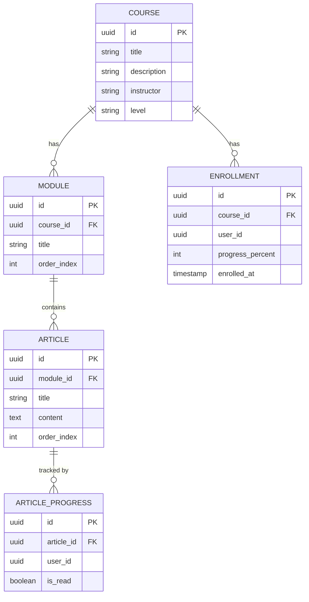
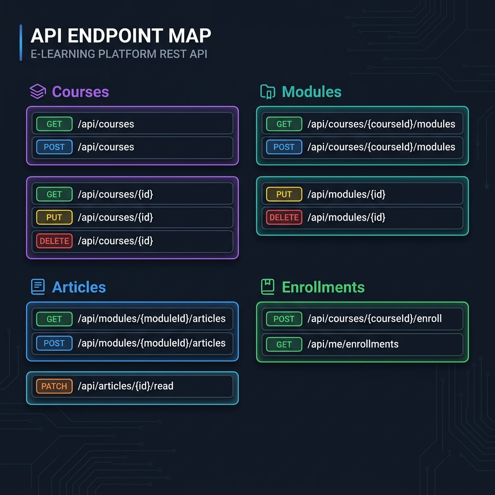
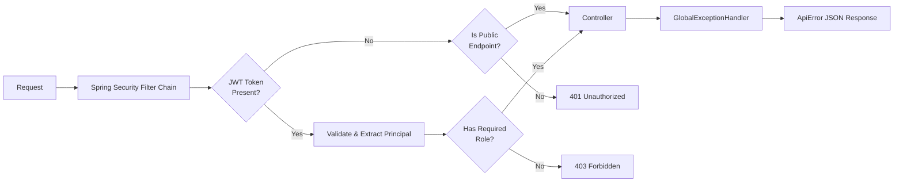

<div align="center">



<br/>


<br/>

> **SkillForge** is a full-stack Learning Management System for students to browse courses, practice coding, optimize their resume with AI, and compete on leaderboards — all in one premium experience.

<br/>

[🚀 Getting Started](#-getting-started) · [🏗 Architecture](#-architecture) · [✨ Features](#-features) · [📡 API Reference](#-api-reference) · [🚢 Deployment](#-deployment)

</div>

---

## 📋 Table of Contents

- [✨ Features](#-features)
- [🏗 Architecture](#-architecture)
- [🗂 Project Structure](#-project-structure)
- [🎨 Frontend](#-frontend)
- [⚙️ Backend](#️-backend)
- [📡 API Reference](#-api-reference)
- [🔐 Security](#-security)
- [🗃 Database](#-database)
- [🚀 Getting Started](#-getting-started)
- [🌍 Environment Variables](#-environment-variables)
- [🚢 Deployment](#-deployment)

---

## ✨ Features



<br/>

| Feature | Description |
|---|---|
| 📚 **Course Catalog** | Browse, filter, and enroll in structured courses with modules & articles |
| 💻 **Practice Sandbox** | Solve coding problems in an in-browser code editor |
| 🤖 **AI Resume Optimizer** | AI-powered resume analysis with keyword suggestions |
| 🏆 **Leaderboard** | Community ranking board to track progress against peers |
| 💬 **AI Chatbot Widget** | Floating AI assistant available across all views |
| 📊 **Student Dashboard** | Unified view of enrolled courses, progress, and streaks |
| 🔐 **Auth System** | Sign in / Sign up with role-based access control |
| 🔔 **Notifications** | Real-time notification feed with unread count |

---

## 🏗 Architecture



<br/>



### Data Flow



---

## 🗂 Project Structure

```
📦 learning-management-system/
├── 📄 package.json                  # Root monorepo — run both services together
├── 📄 README.md
│
├── 🎨 frontend/                     # React 19 + Vite web application
│   ├── 📄 index.html
│   ├── 📄 vite.config.js
│   ├── 📄 tailwind.config.js
│   └── 📁 src/
│       ├── 📄 App.jsx               # Root — tab-based router
│       ├── 📄 main.jsx
│       ├── 📄 index.css
│       ├── 📁 components/
│       │   ├── 🏠 LandingPage.jsx   # Public marketing page
│       │   ├── 🧭 Header.jsx        # Top navigation bar
│       │   ├── 🗃 Sidebar.jsx       # Left navigation panel
│       │   ├── 📊 StudentDashboard.jsx
│       │   ├── 📚 CourseCatalog.jsx
│       │   ├── 💻 PracticeSandbox.jsx
│       │   ├── 🤖 ResumeAIOptimizer.jsx
│       │   ├── 🏆 Leaderboard.jsx
│       │   ├── 💬 AIChatbotWidget.jsx
│       │   ├── 🔑 SignInModal.jsx
│       │   ├── 📝 SignUpModal.jsx
│       │   ├── 🌌 BackgroundShader.jsx
│       │   └── 🔔 Toast.jsx
│       ├── 📁 context/
│       │   └── 🧠 AppContext.jsx    # Global state (user, courses, auth, nav)
│       └── 📁 data/
│           └── 📄 mockData.js       # Fallback data when backend is offline
│
└── ⚙️ backend/                      # Java 17 + Spring Boot REST API
    ├── 📄 pom.xml
    └── 📁 src/main/
        ├── 📁 java/com/skillforge/
        │   ├── 🚀 SkillForgeApplication.java
        │   ├── 📁 course/           # Course / Module / Article / Enrollment domain
        │   │   ├── Course.java  ·  CourseController.java  ·  CourseService.java
        │   │   ├── Module.java  ·  ModuleController.java  ·  ModuleService.java
        │   │   ├── Article.java ·  ArticleController.java ·  ArticleService.java
        │   │   ├── Enrollment.java  ·  EnrollmentController.java
        │   │   ├── ArticleProgress.java
        │   │   └── 📁 dto/          # Request & Response records (no raw entities on API)
        │   ├── 📁 common/           # Shared cross-cutting concerns
        │   │   ├── ApiError.java            # Consistent error response shape
        │   │   ├── GlobalExceptionHandler.java
        │   │   ├── ContentSanitizer.java    # OWASP XSS sanitizer
        │   │   └── CurrentUser.java         # Principal extraction helper
        │   └── 📁 security/
        │       └── SecurityConfig.java      # Spring Security + JWT hooks
        └── 📁 resources/
            └── application.yml             # All config via env vars
```

---

## 🎨 Frontend

The frontend is a **React 19 SPA** built with **Vite 6** and styled with **Tailwind CSS 3**. Navigation is tab-based (no URL routing) — the active view is managed through global `AppContext`.

### Views



### State Management — `AppContext`

All global state is managed via a single **React Context**, with graceful fallback to mock data when the backend is offline:

| State Slice | Description |
|---|---|
| `user` | Authenticated user profile |
| `isAuthenticated` | Boolean auth state |
| `activeTab` | Controls which view is rendered |
| `courses` | Course list + each course's progress |
| `practiceProblems` | Coding challenge list |
| `notifications` | Notification feed + unread badge count |
| `toast` | Global toast notification queue |

### Key Libraries

| Library | Version | Purpose |
|---|---|---|
| `react` | 19 | UI framework |
| `framer-motion` | 12 | Animations & transitions |
| `lucide-react` | 0.475 | Icon library |
| `canvas-confetti` | 1.9 | Celebration effects |
| `tailwindcss` | 3.4 | Utility-first styling |

---

## ⚙️ Backend

The backend is a **Spring Boot 3.3.2** REST API following strict layered architecture:

```
Controller → Service → Repository → JPA Entity → PostgreSQL
```

> Raw JPA entities are **never exposed** on the API — every endpoint uses dedicated DTO records.

### Entity Relationship Diagram



---

## 📡 API Reference



### Courses

| Method | Endpoint | Description | Role |
|---|---|---|---|
| `GET` | `/api/courses` | List all courses | Public |
| `POST` | `/api/courses` | Create a course | 🔴 Admin |
| `GET` | `/api/courses/{id}` | Get course by ID | Public |
| `PUT` | `/api/courses/{id}` | Update course | 🔴 Admin |
| `DELETE` | `/api/courses/{id}` | Delete course | 🔴 Admin |

### Modules

| Method | Endpoint | Description | Role |
|---|---|---|---|
| `GET` | `/api/courses/{courseId}/modules` | List modules | Public |
| `POST` | `/api/courses/{courseId}/modules` | Add module | 🔴 Admin |
| `PUT` | `/api/modules/{id}` | Update module | 🔴 Admin |
| `DELETE` | `/api/modules/{id}` | Delete module | 🔴 Admin |

### Articles

| Method | Endpoint | Description | Role |
|---|---|---|---|
| `GET` | `/api/modules/{moduleId}/articles` | List articles | Public |
| `POST` | `/api/modules/{moduleId}/articles` | Add article | 🔴 Admin |
| `PUT` | `/api/articles/{id}` | Update article | 🔴 Admin |
| `DELETE` | `/api/articles/{id}` | Delete article | 🔴 Admin |
| `PATCH` | `/api/articles/{id}/read` | Mark read + recalculate progress | 🟡 Auth |

### Enrollments

| Method | Endpoint | Description | Role |
|---|---|---|---|
| `POST` | `/api/courses/{courseId}/enroll` | Enroll in a course | 🟡 Auth |
| `GET` | `/api/me/enrollments` | Get my enrollments | 🟡 Auth |

> **Swagger UI** is available when running at: [`http://localhost:8080/swagger-ui.html`](http://localhost:8080/swagger-ui.html)

---

## 🔐 Security



| Mechanism | Implementation |
|---|---|
| **JWT Authentication** | `JwtAuthenticationFilter` (wired via `SecurityConfig`) |
| **RBAC** | `@PreAuthorize("hasRole('ADMIN')")` on admin endpoints |
| **XSS Prevention** | `ContentSanitizer` runs all article content through OWASP HTML Sanitizer on write |
| **Input Validation** | Jakarta Bean Validation (`@NotBlank`, `@Size`, `@Min`) on all request DTOs |
| **Error Handling** | `GlobalExceptionHandler` returns consistent `ApiError` for all failures |

---

## 🗃 Database

- **Engine**: PostgreSQL
- **ORM**: Spring Data JPA / Hibernate
- **DDL Strategy**: `ddl-auto: validate` — the app validates against an existing schema and **never auto-generates or drops tables**
- **Migrations**: Managed externally (outside this repo) — entities must match the schema exactly
- **Connection Pooling**: HikariCP with `maximum-pool-size: 10`

---

## 🚀 Getting Started

### Prerequisites

| Tool | Minimum Version |
|---|---|
| Node.js | 18+ |
| npm | 9+ |
| Java JDK | 17+ |
| Apache Maven | 3.8+ |
| PostgreSQL | 14+ |

### 1. Clone the repository

```bash
git clone https://github.com/your-org/learning-management-system.git
cd learning-management-system
```

### 2. Set environment variables

Create a `.env` or export these in your shell:

```bash
export DB_URL=jdbc:postgresql://<host>:5432/postgres
export DB_USERNAME=your_db_user
export DB_PASSWORD=your_db_password
export JWT_SECRET=your_super_secret_key
```

### 3. Install all dependencies

```bash
npm run install:all
```

### 4. Run the full stack

```bash
npm run dev
```

This starts both servers concurrently:

| Service | URL |
|---|---|
| 🎨 Frontend (Vite) | `http://localhost:5173` |
| ⚙️ Backend (Spring Boot) | `http://localhost:8080` |
| 📖 Swagger UI | `http://localhost:8080/swagger-ui.html` |

### Run individually

```bash
npm run dev:frontend    # React + Vite only
npm run dev:backend     # Spring Boot only
```

> 💡 The frontend gracefully **falls back to mock data** if the backend is not running — great for pure UI development.

---

## 🌍 Environment Variables

| Variable | Required | Default | Description |
|---|---|---|---|
| `DB_URL` | ✅ Yes | — | PostgreSQL JDBC URL |
| `DB_USERNAME` | ✅ Yes | — | Database username |
| `DB_PASSWORD` | ✅ Yes | — | Database password |
| `JWT_SECRET` | ✅ Yes | — | HS256 signing secret for JWT |
| `PORT` | No | `8080` | Backend server port |

---

## 🚢 Deployment

### Backend — Render Web Service

| Field | Value |
|---|---|
| **Environment / Runtime** | `Docker` |
| **Docker Context** | `backend` |
| **Dockerfile Path** | `Dockerfile` |

Add these **Environment Variables** in the Render dashboard:

```
DB_URL         = jdbc:postgresql://<host>:5432/postgres
DB_USERNAME    = ...
DB_PASSWORD    = ...
JWT_SECRET     = ...
```

### Frontend — Render Static Site

| Field | Value |
|---|---|
| **Root Directory** | `frontend` |
| **Build Command** | `npm install && npm run build` |
| **Publish Directory** | `dist` |

---

<div align="center">

Made with ❤️ by the SkillForge Team.........

</div>
...